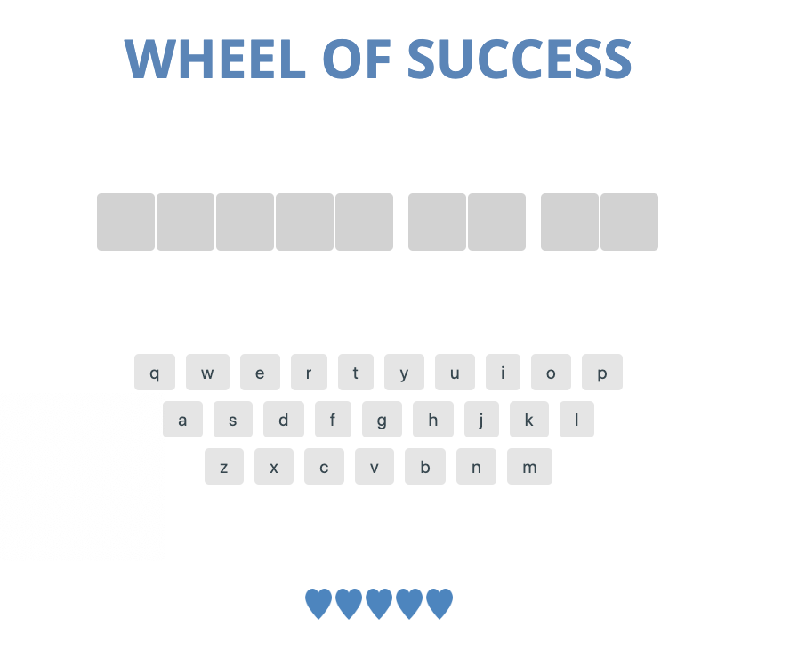

# Wheel of Success

## Live Demo

[Demo](https://wheel-of-success.as12production.com/)

## Description

Wheel of Success is a browser game based on "Wheel of Fortune". The user must correctly guess all letters in the phrase before their lives run out and face the ultimate doom. This application is a compliant progressive web applicant written in vanilla ES6 script, HTML5, and CSS3. The application uses an imperative coding style for ES6.

The project is created as part of a training with Team Treehouse.

# Technology Stack

- PWA
- HTML5
- CSS3
- ES6

## Getting Started

- Simply open HTML files to view individual page. They are self-contained static website.

## License

This app is distributed under GPL v3 License.
